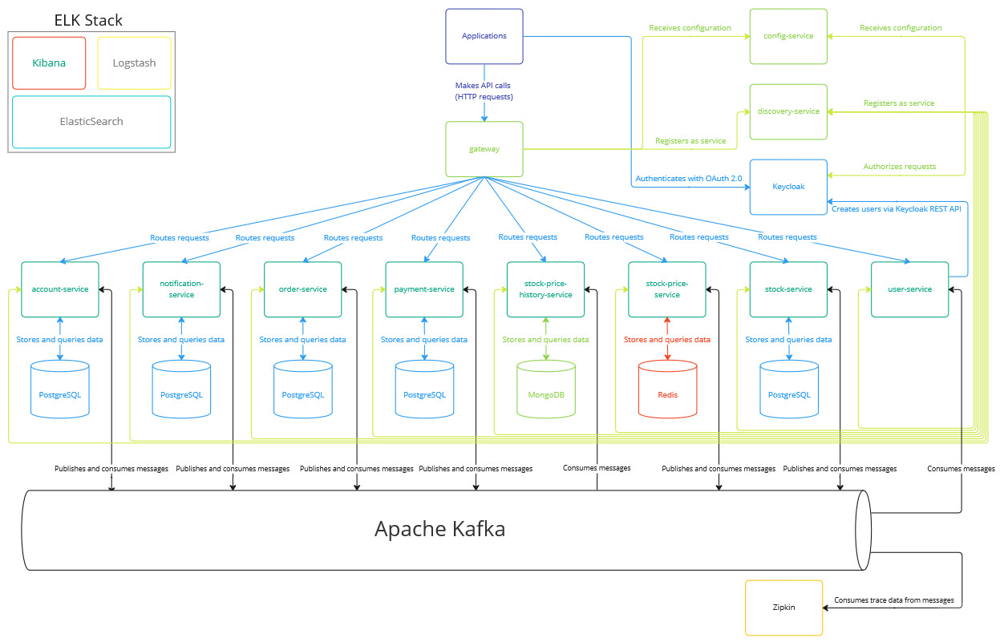

# stock-market

This is Spring Cloud microservices demo project. Here you can find examples of:
- Spring Cloud Config
- Eureka Service Discovery
- Spring Cloud Gateway
- Spring Cloud Circuit Breaker (resilience4j)
- Distributed tracing using Spring Cloud Sleuth & Zipkin
- Spring Kafka
- Authorization & custom client's user creation via Keycloak
- ELK stack using logstash-logback-encoder
- Docker

# Architectural diagram

# Services
- [config-service](infrastructure/config-service) - Centralized configuration
  service. You can access this service at http://localhost:8888 with credentials
  `admin:password`.
- [discovery-service](infrastructure/discovery-service) - Service that implements
  the Service Discovery Mechanism in microservices. You can access this service at 
  http://localhost:8761 with credentials `admin:password`.
- [gateway](infrastructure/gateway) - An API Gateway. Used to access other service.
  You can access the gateway at http://localhost:8080.
- [account-service](services/account-service) - A microservice responsible for 
  managing user accounts.
- [notification-service](services/notification-service) - A microservice responsible
  for user notifications such as order status changes, stock prices, and 
  creating custom stock price notifications.
- [order-service](services/order-service) - A microservice responsible for 
  orders processing.
- [payment-service](services/payment-service) - A microservice implementing a 
  simple payment gateway.
- [stock-price-history-service](services/stock-price-history-service) - 
  A microservice that store the stock price history.
- [stock-price-service](services/stock-price-service) - A microservice that
  randomly changes stock prices.
- [stock-service](services/stock-service) - A microservice responsible for
  creating new stocks and receiving existing ones.
- [user-service](services/user-service) - A microservice responsible for creating
  users with specific roles via Keycloak API.

# How to run
You need to have Java 17, Docker and Maven (Optional, you can use mvnw)

You can run the services using an IDE like Intellij IDEA or Eclipse.

## Run infrastructural components
Run all infrastructural components in containers (Kafka, Postgres, MongoDB,
Redis, Keycloak) with the following command:

    cd docker
    docker-compose up

## Run microservices

You can do this with your favorite IDE or using Maven.

You can build all services with the following command:

    mvn clean install

How to run a specific service can be found in its documentation

Firstly, you need to run the [/infrastructure](infrastructure) microservices in following order: 

- config-service
- discovery-service
- gateway

Then you can run other [/services](services) in any order.

## ELK stack (Optional)

You can use the ELK stack for analyzing the generated logs. You can find more 
[here](https://www.elastic.co/what-is/elk-stack).

Run ELK with the following command:

    cd docker
    docker compose -f docker-compose.yml -f docker-compose.elk.yml up

All microservices must run with "elk" profile.

## Distributed tracing (Optional)

You can use Spring Cloud Sleuth and Zipkin for distributed tracing.

Run Zipkin with the following command:

    cd docker
    docker compose -f docker-compose.yml -f docker-compose.distributed-tracing.yml up

All microservices (except config-service and discovery-service) should run with
"distributed-tracing" profile.